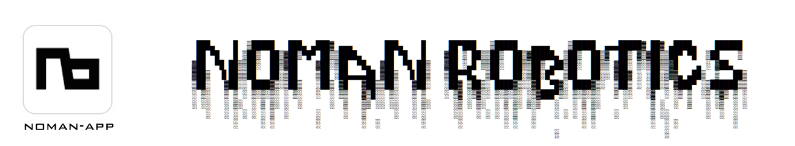

<div align="right">

[English](README.md) | [中文](README.zh-CN.md)

</div>

<div align="center">
  
</div>

Noman-app是一个轻量级、跨平台的机械臂用户界面，使用Python/Cython实现。它提供了路径规划、碰撞避免和自动化的解决方案，是MoveIt和Pinocchio等工具的替代选择。后端结合了路径规划和自动化功能，如PTP、LIN和CIRC运动，这些通常在KRL和RoboDK等工业级应用中看到。

**注意：**这是我们的第一个版本，仍在开发中。


## 安装

对于喜欢在本地环境使用终端的用户：

```
pip install -r requirements.txt
pip install [WHEEL-NAME] # 您需要从发布页面下载.whl文件
python src/main.py
```

对于喜欢按操作系统下载应用程序的用户，请从[最新发布页面](https://github.com/NoManRobotics/noman-app/releases)下载可执行文件。

[all-wheels](https://github.com/NoManRobotics/noman-app/releases)压缩包也可在发布页面获取，如果您使用终端，必须安装与您操作系统匹配的特定.whl文件。

**Linux用户**需要取消网络代理设置以避免openai方案问题：

```
unset all_proxy; unset ALL_PROXY
```

## 主要功能

| 功能 | 描述 |
|:---:|---|
| **机器人配置** | - 上传URDF/Xacro文件<br>- 配置关节限制、初始位置<br>- 工具中心点偏移<br>- 兼容第三方机械臂 |
| **运动规划** | - RRT*、CHOMP算法生成无碰撞轨迹<br>- 解析求解器（阻尼最小二乘法、Levenberg-Marquardt、IK track）<br>- 自碰撞和环境碰撞检测<br>- 工作空间分析和关节限制验证 |
| **机器人编程语言** | - 执行G代码命令（PTP、LIN、CIRC、HOME、DELAY、TOOL、M280）<br>- 示教编程<br>- Text2gcode绘图任务 |
| **轨迹优化** | - 笛卡尔空间：线性插值和三次B样条<br>- 关节空间：梯形、S曲线和多项式 |
| **仿真器** | - 基于PyBullet的仿真环境<br>- 支持导入URDF/STL/OBJ格式对象和内置几何形状<br>- 工具中心点偏移和基座位置配置 |
| **协议支持** | 为提供从仿真到真实机器人的无缝体验，我们开发了<br>- UART串口协议<br>- CAN等协议（尚未支持） |


## 支持

我们提供由我们团队设计和验证的官方机器人配置文件，以确保完整的软件兼容性和功能验证。如需全面的技术文档、教程和支持资源，请访问我们的[技术支持页面](https://nomanrobotics.com/techsupport/)。

## TO-DOs
Priority 1 Basic Supports

- [x] add detector types, including template matching, color detector.
- [x] Replay with speed control
- [x] Optimise text2gcode gcode trajectory
- [x] Detect and grab.
- [x] Added build-in cartesian interpolator during planer.plan stage (pathpoints)
- [x] Support custom solver added by user.
- [x] Make command look-up a same class file in controller frame and anytroller frame
- [ ] Test the software on Parol6 stepper motors.
- [x] languange support in sub-frames
- [x] MacOS simulator gui fix, shape loading.
- [x] Majordomo only keeps API, remove local models
- [x] tool/base coordinate systems
- [ ] user can add world/tool coordinate systems
- [x] Trajectory Optimiser in joint space and cartesian space.
- [x] setting: individial speed/acc/jerk setting, real-time optimiser method switch.
- [ ] Upon joint position control, user can choose to output joint speed in planner output
- [ ] LIN/CIRC require time parameterization, and use jacobian to optimise joint speed


Priority 2 Advanced features

- [ ] Lookahead algorithm in trajectory optimisation. (multi-joint-positions)
- [ ] Add DH param support.
- [ ] Advanced feature in gcode ui: add point selection to optimise in between.
- [ ] Slider plus/ minus button real time execution on robot arm side.
- [ ] Json trajectory to gcode
- [ ] task sequence decomposer from assembly.
- [ ] Mujoco interface
- [x] add phone as a camera for the robot arm
- [ ] tic tac tok.
- [ ] multi-robot tasking
- [ ] point cloud (pyzed)
- [ ] Spatial AI


## Credits (Updated by 18/06/2025)

This project uses the following third-party components:

### Python libraries

- esptool
  - Copyright (c) 2014-2022 Fredrik Ahlberg, Angus Gratton et al.
  - Licensed under the [GPL-2.0 License](https://www.gnu.org/licenses/old-licenses/gpl-2.0.en.html)
  - Source: https://github.com/espressif/esptool

- avrdude
  - Copyright (c) 2000-2005 Brian S. Dean
  - Licensed under the [GPL-2.0 License](https://www.gnu.org/licenses/old-licenses/gpl-2.0.en.html)
  - Source: https://github.com/avrdudes/avrdude
